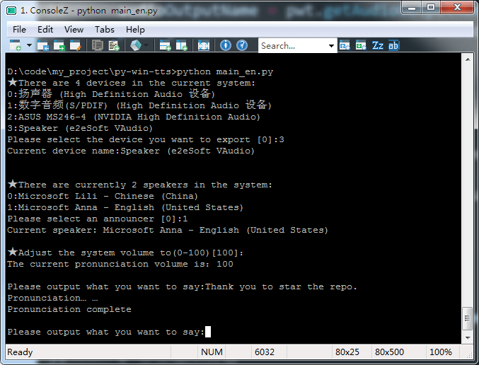

# py-win-tts

English　[中文文档](README_CN.md)


> Speech synthesis system based on SAPI.SpVoic
>
> Through this system, text-to-speech can be quickly realized and output to the designated playback device





## Requirement

- windows 7、windows 8、windows 10
- Microsoft Speech SDK 5.1 And Above
- Python3


## Installation

```bash
git clone https://github.com/kajweb/py-win-tts.git
cd py-win-tts
pip install -r requirements.txt
```


## Usage
In this repository, two example methods are preset, namely `main.py` and `simple.py`, you can

   - In `CMD command line` call the `simple.py` file

     ```bash
     python simple.py
     ```

   - In `CMD command line ` call the `main.py` file

     ```bash
     python main.py
     ```


​    

- You can also create a `*.py` file by yourself, create the following content and call the file via `python`.

```python
from PyWinTTS import *;
pwt = pyWinTTS();
pwt.speak( "sentence" );
```

> Without selecting the output device, the default audio output device is output to the system's default audio output device.


## Methods

### getAudioOutput()

Get the current output device


### setAudioOutput( index )

Set output device


### getVoice()

Get current announcer


### setVoice( index )

Set announcer


### getVolume()

Get current volume


### setVolume( value )

Set volume


### speak( sentence, flags=0 )

start speaking


[More Methods](https://github.com/kajweb/py-win-tts/wiki/Methods)　[More Properties](https://github.com/kajweb/py-win-tts/wiki/Properties)


##  Note

Because `Microsoft Speech SDK` can only run in `windows` environment, and this project depends on `Microsoft Speech SDK`, so this project **only supports `windows` system**, other systems need to perform `SAPI.SpVoic` Compatible processing.


For more help, please go to [Wiki page](https://github.com/kajweb/py-win-tts/wiki) to view the help

## License

MIT